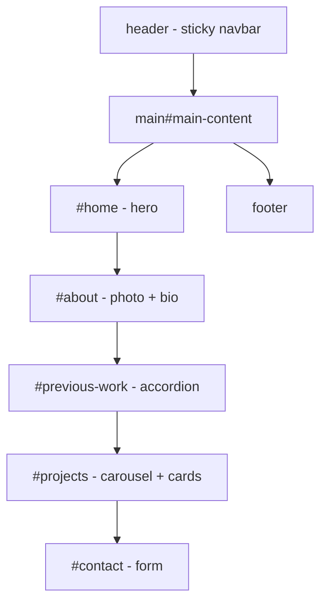
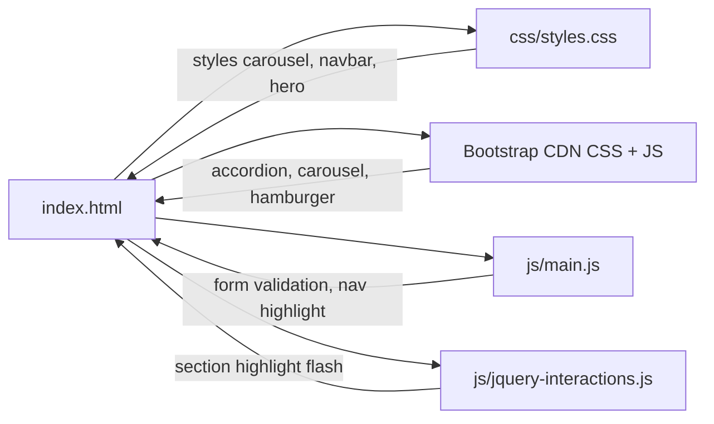
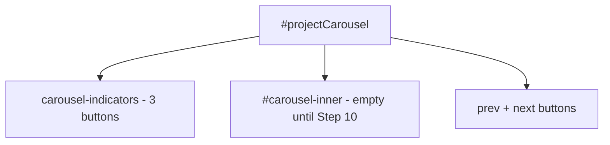
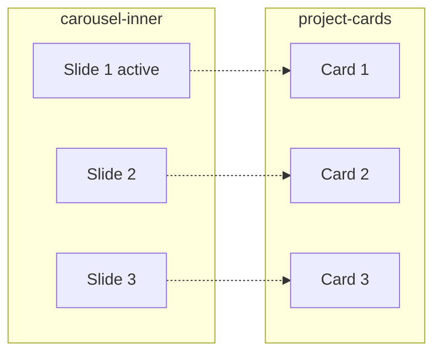
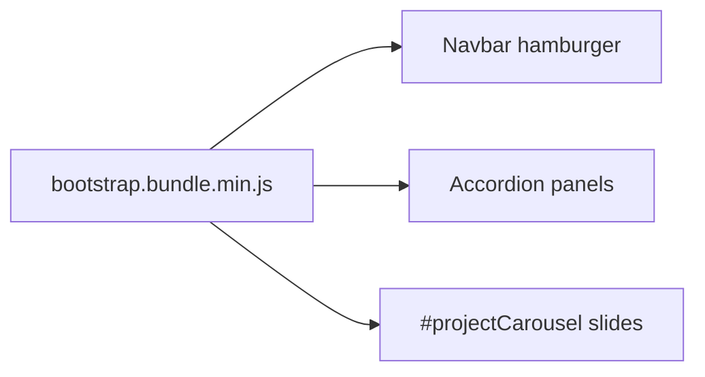

# Build Steps: emmarthur.github.io

Tiny steps I used to rebuild the final project website from scratch. I implemented each step in order. Commits happen at planned checkpoints (6+ meaningful commits total).

Explanations below are written in plain language so each tag and attribute is easy to understand.

## Documentation map

| File                            | What it covers                             |
| ------------------------------- | ------------------------------------------ |
| `README.md`                     | How to run the site, deployment, libraries |
| `BUILD-STEPS.md`                | This file - step-by-step rebuild log       |
| `CAROUSEL-DEEP-DIVE.md`         | In-depth beyond-class carousel (for video) |
| `VIDEO-PRESENTATION-OUTLINE.md` | What to say while recording                |
| `DESIGN-CHANGES.md`             | Design decisions (e.g. sticky header)      |
| `WAVE-AUDIT-FIXES.md`           | Accessibility audit fixes                  |

## Site layout (one page)

All sections live inside a single `index.html`. The navbar links jump to each area with hash URLs (`#about`, etc.).



## How the files work together



## How to run the finished site (no VS Code required)

The completed site is **static HTML**. No VS Code, Live Server, npm, Node.js, or Git is required to view it.

| Method               | What to do                                                                               |
| -------------------- | ---------------------------------------------------------------------------------------- |
| **View online**      | Open https://emmarthur.github.io/ in Chrome, Edge, Firefox, or Safari                    |
| **Local folder**     | Double-click `index.html` in the project folder (File Explorer / Finder)                 |
| **Clone (optional)** | `git clone https://github.com/emmarthur/emmarthur.github.io.git`, then open `index.html` |

**Keep in mind:**

- Bootstrap and jQuery load from CDN - use an **internet connection** for full styling and interactivity.
- Do not move `index.html` out of the folder; `css/`, `js/`, and `images/` must stay beside it.
- VS Code + Live Server is **optional** and only useful while editing files.

See `README.md` for the same run instructions and deployment details.

## Deployment (GitHub Pages)

| Item              | Value                                            |
| ----------------- | ------------------------------------------------ |
| GitHub repository | https://github.com/emmarthur/emmarthur.github.io |
| Live site         | https://emmarthur.github.io/                     |
| Branch            | `main`                                           |
| Pages folder      | `/ (root)`                                       |

**First-time setup:** Repo > Settings > Pages > Source: **Deploy from a branch** > branch **`main`**, folder **`/ (root)`** > **Save**.

**After code changes:** Commit locally, then `git push origin main`. GitHub Pages rebuilds in about one to two minutes. No build step required.

---

## Beyond class vs. from class

The final project **additional requirements** ask for Bootstrap elements **not covered in the lab notebook**. The instructions explicitly name the **accordion** and **image carousel** as examples.

| Feature                                        | Meets "beyond class"?                                | Where                              | Step    | Deep-dive doc           |
| ---------------------------------------------- | ---------------------------------------------------- | ---------------------------------- | ------- | ----------------------- |
| **Bootstrap accordion** (Previous Work)        | Yes                                                  | `#workAccordion` in `index.html`   | 7       | -                       |
| **Bootstrap carousel** (Projects)              | Yes - **video deep dive**                            | `#projectCarousel` in `index.html` | 9-10    | `CAROUSEL-DEEP-DIVE.md` |
| **Custom form validation** (`main.js`)         | General JS requirement (extends class form patterns) | `#contact-form` + `js/main.js`     | 11, 13  | -                       |
| **Skip link**                                  | Removed from final site (was planned in Step 3)      | -                                  | -       | -                       |
| **Navbar, grid, cards, Bootstrap form markup** | From class / homework                                | Throughout                         | 2-6, 11 | -                       |

I use the **carousel** as my main beyond-class explanation in the **video** (`CAROUSEL-DEEP-DIVE.md` + `VIDEO-PRESENTATION-OUTLINE.md` Section 3). I mention the accordion briefly.

---

## Commit checkpoints (planned)

| Commit | After step(s) | Message idea                            |
| ------ | ------------- | --------------------------------------- |
| 1      | Step 1        | Add HTML5 document skeleton             |
| 2      | Steps 2-4     | Link stylesheets and add navbar         |
| 3      | Steps 5-7     | Add About and Previous Work sections    |
| 4      | Steps 8-10    | Add Projects section and carousel       |
| 5      | Steps 11-13   | Add contact form and JavaScript         |
| 6      | Steps 14-15   | README, jQuery, final polish and deploy |

---

## Step 1: HTML document skeleton

**Status:** Done

**Goal:** Create the basic empty page file that every website starts from.

**Why:** Before adding text, images, or buttons, the browser needs to know what kind of file this is and how to read it. This step sets up that foundation.

**What I added** (`index.html`):

```html
<!doctype html>
<html lang="en">
  <head>
    <meta charset="UTF-8" />
    <meta name="viewport" content="width=device-width, initial-scale=1.0" />
    <title>Emmanuel Arthur | Personal Website</title>
  </head>
  <body></body>
</html>
```

**What each part means:**

| Line                         | What it is       | Simple explanation                                                                            |
| ---------------------------- | ---------------- | --------------------------------------------------------------------------------------------- |
| `<!doctype html>`            | Doctype          | Tells the browser: "This is a modern HTML page." It goes at the very top.                     |
| `<html lang="en">`           | Root element     | Wraps the entire page. `lang="en"` means the page is in English, which helps screen readers.  |
| `<head>`                     | Head section     | Holds behind-the-scenes info. Stuff here does not show on the page itself.                    |
| `<meta charset="UTF-8" />`   | Character set    | Lets the browser show letters and symbols correctly (like accented letters).                  |
| `<meta name="viewport" ...>` | Viewport setting | Makes the page fit phone screens instead of looking zoomed out and tiny.                      |
| `<title>...</title>`         | Page title       | The text shown in the browser tab at the top.                                                 |
| `<body>`                     | Body section     | Where all visible content will go later (text, images, nav bar, etc.). Right now it is empty. |
| `</html>`                    | Closing tag      | Ends the page. Most tags come in pairs: open and close.                                       |

**Check:** Open the file in a browser. Expected: a blank white page, and the tab title "Emmanuel Arthur | Personal Website".

---

## Step 2: Link Bootstrap and custom CSS

**Status:** Done

**Goal:** Connect two style files so the page can use Bootstrap and my custom colors and layout later.

**Why:** HTML builds the structure. CSS makes it look good. Instead of writing all styles from scratch, I borrow Bootstrap (a pre-made style library from class) and add my own file for extra tweaks.

**What I added:** Inside `<head>`, after the `<title>` line:

```html
<link
  href="https://cdn.jsdelivr.net/npm/bootstrap@5.3.3/dist/css/bootstrap.min.css"
  rel="stylesheet"
/>
<link rel="stylesheet" href="css/styles.css" />
```

**What each part means:**

| Line                                  | What it is        | Simple explanation                                                                            |
| ------------------------------------- | ----------------- | --------------------------------------------------------------------------------------------- |
| `<link ...>`                          | Link tag          | Connects an outside file to the page. Used for CSS, icons, and similar resources.             |
| `href="https://cdn.jsdelivr.net/..."` | File location     | The web address where Bootstrap's CSS file lives. The browser downloads it from the internet. |
| `rel="stylesheet"`                    | Relationship type | Tells the browser: "This linked file is a stylesheet (CSS)."                                  |
| `href="css/styles.css"`               | Local file path   | Points to my CSS file in the `css` folder. I add custom styles here in Step 14.               |

Leave `css/styles.css` empty for now. The links still work; there is just nothing custom to apply yet.

**Check:** Reload the page. It should still look blank. Open DevTools (F12) > Network tab and confirm both CSS files load without red errors.

---

## Step 3: Meta description

**Status:** Done

**Goal:** Add a short page summary for search engines.

**Why:** In the accessibility unit we learned that good pages work for everyone. The meta description helps Google and other sites understand what the page is about.

**Note:** An early draft included a skip link (`<a class="skip-link" href="#main-content">`). I removed it from the final site after WAVE review. The final `index.html` has only the meta description from this step.

**What I added:** In `<head>`, after the viewport `<meta>` line:

```html
<meta
  name="description"
  content="Personal website of Emmanuel Arthur, software engineer and computer science student."
/>
```

**What each part means:**

| Line                            | What it is           | Simple explanation                                                                        |
| ------------------------------- | -------------------- | ----------------------------------------------------------------------------------------- |
| `<meta name="description" ...>` | Description meta tag | A short summary of the page. Search results sometimes show this text under the site name. |
| `content="..."`                 | The actual summary   | The sentence that describes the site. Keep it simple and honest.                          |

**Check:** Reload the page. View page source and confirm the meta description is inside `<head>`.

---

## Step 4: Bootstrap navbar

**Status:** Done

**Goal:** Add a navigation bar at the top so visitors can jump to each section of my one-page site.

**Why:** The final project requires a navbar. Bootstrap gives a ready-made bar that looks good on desktop and collapses to a hamburger menu on phones. Putting it inside `<header>` tells browsers and screen readers "this is the top navigation area."

**Design choice:** The navbar brand (my name) links to `#home` and carries `aria-current="page"` when on the home section. There is **no separate Home nav item** - this avoids a redundant link that WAVE would flag.

**What I added:** At the top of `<body>`:

```html
<header class="sticky-top">
  <nav class="navbar navbar-expand-lg navbar-dark bg-dark" aria-label="Primary">
    <div class="container">
      <a class="navbar-brand fw-semibold" href="#home" aria-current="page"
        >Emmanuel Arthur</a
      >
      <button
        class="navbar-toggler"
        type="button"
        data-bs-toggle="collapse"
        data-bs-target="#siteNav"
        aria-controls="siteNav"
        aria-expanded="false"
        aria-label="Toggle navigation"
      >
        <span class="navbar-toggler-icon"></span>
      </button>
      <div class="collapse navbar-collapse" id="siteNav">
        <ul class="navbar-nav ms-auto">
          <li class="nav-item">
            <a class="nav-link" href="#about">About</a>
          </li>
          <li class="nav-item">
            <a class="nav-link" href="#previous-work">Previous Work</a>
          </li>
          <li class="nav-item">
            <a class="nav-link" href="#projects">Projects</a>
          </li>
          <li class="nav-item">
            <a class="nav-link" href="#contact">Contact</a>
          </li>
        </ul>
      </div>
    </div>
  </nav>
</header>
```

**What each part means:**

| Line / attribute                    | What it is          | Simple explanation                                                                                       |
| ----------------------------------- | ------------------- | -------------------------------------------------------------------------------------------------------- |
| `<header class="sticky-top">`       | Header element      | Groups the top-of-page navigation. `sticky-top` keeps the whole header pinned at the top when scrolling. |
| `<nav>`                             | Navigation element  | Marks this block as the main menu links.                                                                 |
| `class="navbar ..."`                | Bootstrap classes   | Turns the nav into a Bootstrap navbar. `expand-lg` means full links show on large screens.               |
| `navbar-dark bg-dark`               | Color theme         | Dark background with light text. Works immediately without custom CSS.                                   |
| `aria-label="Primary"`              | Accessibility label | Tells screen readers this is the main navigation.                                                        |
| `container`                         | Bootstrap layout    | Centers content and adds side padding so links are not glued to the screen edge.                         |
| `navbar-brand` + `href="#home"`     | Brand link          | My name on the left jumps to the home section. `aria-current="page"` marks it as the current section.    |
| `navbar-toggler`                    | Menu button         | The hamburger icon on small screens. Needs Bootstrap JavaScript later to open and close.                 |
| `data-bs-toggle` / `data-bs-target` | Bootstrap hooks     | Connect the button to the collapsible menu (`#siteNav`).                                                 |
| `navbar-nav ms-auto`                | Nav list            | `ms-auto` pushes the links to the right side of the bar.                                                 |
| `nav-link` + `href="#about"` etc.   | Section links       | `#` plus an id jumps to that section on the same page.                                                   |

**Check:** Reload the page. Expected: a dark bar with my name and four nav links (no Home link). Resize narrow - the links hide behind a hamburger (opens after Bootstrap JS). This completes **Commit 2** when ready to commit.

---

## Step 5: Main content and Home hero

**Status:** Done

**Goal:** Wrap the page's main content and add the Home section that visitors land on first.

**Why:** The navbar brand needs a real destination (`#home`). `<main>` is the semantic wrapper for the primary content (not the nav). The Home section adds a hero area with my name, a short intro, and a button to the About section.

**Design choice:** The hero uses a `.hero-panel` wrapper and a `<button id="hero-about-btn">` instead of an anchor link. JavaScript in `main.js` scrolls to About smoothly. This avoids a duplicate About link that WAVE would flag.

**What I added:** Right after `</header>`, inside `<body>`:

```html
<main id="main-content">
  <section id="home" class="bg-dark text-white" aria-labelledby="home-heading">
    <div class="container py-5">
      <div class="hero-panel text-center">
        <h1 id="home-heading">Emmanuel Arthur</h1>
        <p class="lead">
          Software engineer and MS Computer Science student building web
          applications, cloud systems, and data tools.
        </p>
        <button type="button" class="btn btn-light btn-lg" id="hero-about-btn">
          Learn more about me
        </button>
      </div>
    </div>
  </section>
</main>
```

**What each part means:**

| Line / attribute                 | What it is            | Simple explanation                                                               |
| -------------------------------- | --------------------- | -------------------------------------------------------------------------------- |
| `<main id="main-content">`       | Main landmark         | Holds the primary page content.                                                  |
| `<section id="home">`            | Home section          | A chunk of the page with its own id so `#home` links work from the navbar brand. |
| `class="bg-dark text-white"`     | Bootstrap colors      | Dark background, light text - looks styled without custom CSS yet.               |
| `aria-labelledby="home-heading"` | Section label         | Connects this section to its heading for screen readers.                         |
| `.hero-panel`                    | Custom panel wrapper  | I style this in Step 14 with a solid background for WAVE contrast.               |
| `<h1 id="home-heading">`         | Main heading          | The biggest title on the page. One `<h1>` per page is best practice.             |
| `class="lead"`                   | Intro paragraph style | Bootstrap makes this paragraph slightly larger for a hero intro.                 |
| `button#hero-about-btn`          | Hero button           | Not an anchor - `main.js` handles smooth scroll to `#about`.                     |

**Check:** Reload the page. Expected: my name and intro below the navbar. Click the brand name - it should scroll to this section.

---

## Step 6: About section

**Status:** Done

**Goal:** Add an About section with my photo and a short bio.

**Why:** The final project requires an About section with a photo. This is also where the hero button and navbar **About** link jump to (`#about`).

**What I added:** Inside `<main>`, after the Home section:

```html
<section id="about" class="container py-5" aria-labelledby="about-heading">
  <header class="mb-4">
    <h2 id="about-heading">About</h2>
  </header>
  <div class="row align-items-center g-4">
    <div class="col-md-4 text-center">
      <figure class="mb-0">
        
      </figure>
    </div>
    <div class="col-md-8">
      <article>
        <p>
          I am a software engineer with experience at BlackRock in observability
          and internal tooling...
        </p>
        <p>
          I earned a BA in Computer Science from Reed College and I am
          completing an MS in Computer Science at Portland State University...
        </p>
      </article>
    </div>
  </div>
</section>
```

**What each part means:**

| Line / attribute                  | What it is       | Simple explanation                                                                       |
| --------------------------------- | ---------------- | ---------------------------------------------------------------------------------------- |
| `<section id="about">`            | About section    | Its own chunk of the page; `#about` links land here.                                     |
| `class="container py-5"`          | Layout + spacing | Bootstrap centers content and adds padding top/bottom.                                   |
| `aria-labelledby="about-heading"` | Section label    | Tells screen readers the section title is the `<h2>`.                                    |
| `<h2 id="about-heading">`         | Section heading  | Second-level heading (smaller than the page `<h1>`).                                     |
| `row` / `col-md-4` / `col-md-8`   | Bootstrap grid   | Photo on the left, text on the right on medium+ screens; stacks on phones.               |
| `<figure>`                        | Image wrapper    | Groups the photo; semantic HTML for illustrations.                                       |
| ``             | Photo            | `alt` describes the portrait for screen readers. Photo file: `images/1683647827149.jpg`. |
| `img-fluid rounded-circle`        | Image styling    | Scales with the screen; makes the photo circular.                                        |
| `<article>`                       | Bio text block   | Wraps my bio paragraphs.                                                                 |

**Check:** Reload the page. Click **About** in the nav - the page should jump to this section. Portrait file: `images/1683647827149.jpg`.

---

## Step 7: Previous Work accordion

**Status:** Done

**Goal:** Show my jobs and education in a collapsible accordion so the page stays tidy.

**Why:** The final project asks for Previous Work. A Bootstrap accordion is an extra component **beyond class** (not covered in the lab notebook) - it lets visitors expand one item at a time instead of scrolling through a long list.

**Beyond class:** This step satisfies the additional requirement for a Bootstrap accordion (see table at top of this file).

**What I added:** Inside `<main>`, after the About section:

```html
<section
  id="previous-work"
  class="bg-light py-5"
  aria-labelledby="previous-work-heading"
>
  <div class="container">
    <header class="mb-4">
      <h2 id="previous-work-heading">Previous Work</h2>
      <p class="text-muted">
        Professional experience and education. Click each row to expand details.
      </p>
    </header>

    <div class="accordion" id="workAccordion">
      <div class="accordion-item">
        <h3 class="accordion-header" id="heading-blackrock-obs">
          <button
            class="accordion-button"
            type="button"
            data-bs-toggle="collapse"
            data-bs-target="#collapse-blackrock-obs"
            aria-expanded="true"
            aria-controls="collapse-blackrock-obs"
          >
            BlackRock, Analyst, Aladdin Engineering (Observability)
          </button>
        </h3>
        <div
          id="collapse-blackrock-obs"
          class="accordion-collapse collapse show"
          aria-labelledby="heading-blackrock-obs"
          data-bs-parent="#workAccordion"
        >
          <div class="accordion-body">
            May 2024 to July 2025. Built Java and Spring MVC tooling...
          </div>
        </div>
      </div>
      <!-- Two more accordion-item blocks: BlackRock Technology Support, Education -->
    </div>
  </div>
</section>
```

**What each part means:**

| Line / attribute                  | What it is            | Simple explanation                                           |
| --------------------------------- | --------------------- | ------------------------------------------------------------ |
| `<section id="previous-work">`    | Previous Work section | Navbar link `#previous-work` jumps here.                     |
| `class="bg-light py-5"`           | Section styling       | Light gray background and vertical padding (Bootstrap only). |
| `accordion` / `accordion-item`    | Bootstrap accordion   | Container and rows for each expandable entry.                |
| `accordion-button`                | Clickable header      | The visible job or school title; click to open/close.        |
| `data-bs-toggle="collapse"`       | Bootstrap hook        | Tells Bootstrap this button controls a collapsible panel.    |
| `data-bs-target="#collapse-..."`  | Panel target          | Links the button to the matching panel id.                   |
| `collapse show` vs `collapsed`    | Open vs closed        | First panel starts open (`show`); others start closed.       |
| `data-bs-parent="#workAccordion"` | One-at-a-time mode    | Opening one panel closes the others in the same group.       |
| `accordion-body`                  | Panel content         | The detail text shown when a row is expanded.                |

**Check:** Reload the page. Expected: three accordion rows; first panel open by default. Headers animate after Bootstrap JS in Step 12. This completes **Commit 3** (steps 5-7) when ready.

---

## Step 8: Projects section header

**Status:** Done

**Goal:** Start the Projects section with a title and short intro before adding the carousel and project cards.

**Why:** The final project requires 2-3 projects from outside the course. This step sets up the section shell so navbar link `#projects` has somewhere to land.

**What I added:** Inside `<main>`, after Previous Work:

```html
<section
  id="projects"
  class="container py-5"
  aria-labelledby="projects-heading"
>
  <header class="text-center mb-4">
    <h2 id="projects-heading">Projects</h2>
    <p class="text-muted col-lg-8 mx-auto">
      Selected work from outside this course. Each project includes a
      description and links to the repository and deployed site when available.
    </p>
  </header>
  <!-- Carousel and cards added in Steps 9-10 -->
</section>
```

**What each part means:**

| Line / attribute                     | What it is       | Simple explanation                                                          |
| ------------------------------------ | ---------------- | --------------------------------------------------------------------------- |
| `<section id="projects">`            | Projects section | Matches the **Projects** link in the navbar.                                |
| `class="container py-5"`             | Layout + spacing | Centers content with Bootstrap padding.                                     |
| `aria-labelledby="projects-heading"` | Section label    | Connects the section to its `<h2>` for screen readers.                      |
| `<h2 id="projects-heading">`         | Section title    | Second-level heading for this part of the page.                             |
| Intro paragraph                      | Context text     | Explains these are non-course projects with repo links coming in the cards. |

**Check:** Reload and click **Projects** in the nav - the page should jump to the heading and intro.

---

## Step 9: Projects carousel shell

**Status:** Done

**Goal:** Add the Bootstrap carousel frame inside Projects - indicators, slide container, and prev/next buttons.

**Why:** The final project should go beyond basic class work. A carousel is a Bootstrap component **not covered in the lab notebook**. This step builds the structure; slide images and text come in Step 10.

**Beyond class:** Carousel shell (Steps 9-10 together satisfy the additional requirement). Full explanation: `CAROUSEL-DEEP-DIVE.md`.

**In plain terms:** I am building a slideshow box. The dots and arrows are wired up in HTML, but nothing moves until Bootstrap JavaScript loads in Step 12.

**What I added:** After the Projects header inside `#projects`:

```html
<div
  id="projectCarousel"
  class="carousel slide mb-4"
  data-bs-ride="carousel"
  aria-label="Project highlights carousel"
>
  <div class="carousel-indicators">
    <button
      type="button"
      data-bs-target="#projectCarousel"
      data-bs-slide-to="0"
      class="active"
      aria-current="true"
      aria-label="Slide 1"
    ></button>
    <button
      type="button"
      data-bs-target="#projectCarousel"
      data-bs-slide-to="1"
      aria-label="Slide 2"
    ></button>
    <button
      type="button"
      data-bs-target="#projectCarousel"
      data-bs-slide-to="2"
      aria-label="Slide 3"
    ></button>
  </div>
  <div class="carousel-inner" id="carousel-inner">
    <!-- Slides added in Step 10 -->
  </div>
  <button
    class="carousel-control-prev"
    type="button"
    data-bs-target="#projectCarousel"
    data-bs-slide="prev"
  >
    <span class="carousel-control-prev-icon" aria-hidden="true"></span>
    <span class="visually-hidden">Previous</span>
  </button>
  <button
    class="carousel-control-next"
    type="button"
    data-bs-target="#projectCarousel"
    data-bs-slide="next"
  >
    <span class="carousel-control-next-icon" aria-hidden="true"></span>
    <span class="visually-hidden">Next</span>
  </button>
</div>
```



**What each part means:**

| Line / attribute                  | What it is         | Simple explanation                                                   |
| --------------------------------- | ------------------ | -------------------------------------------------------------------- |
| `id="projectCarousel"`            | Unique carousel id | Every control uses `data-bs-target="#projectCarousel"` to link here. |
| `carousel slide`                  | Carousel wrapper   | Bootstrap classes that turn this div into a slideshow.               |
| `data-bs-ride="carousel"`         | Auto-start hint    | Tells Bootstrap to initialize the carousel when JS loads.            |
| `carousel-indicators`             | Dot buttons        | Small buttons at the bottom to jump to slide 1, 2, or 3.             |
| `data-bs-slide-to="0"`            | Slide index        | Each dot links to a slide number (0 = first, 1 = second, etc.).      |
| `#carousel-inner`                 | Slide container    | Empty for now - Step 10 adds the actual slide markup here.           |
| `carousel-control-prev` / `-next` | Arrow buttons      | Left and right arrows to move between slides.                        |
| `visually-hidden`                 | Screen reader text | Hides "Previous"/"Next" visually but keeps them for accessibility.   |

**Check:** Reload the page. The carousel area may look empty until Step 10 adds slides. Controls animate after Bootstrap JS in Step 12.

---

## Step 10: Project slides and cards

**Status:** Done

**Goal:** Fill the carousel with three project slides and add matching Bootstrap cards in a grid below.

**Why:** Visitors see projects twice - once in the rotating **beyond-class carousel** and once as scannable cards with GitHub links. All three projects are from outside this course, as required.

**Beyond class:** Carousel slides complete the carousel requirement. See `CAROUSEL-DEEP-DIVE.md` for the full video explanation.

**In plain terms:** Each `carousel-item` is one slide. The first slide has `active` so it shows when the page opens. The cards below repeat the same projects with GitHub buttons.

**What I added:**

1. Three `<div class="carousel-item">` slides inside `#carousel-inner` (first one has `active`).
2. A `#project-cards` row with three Bootstrap cards - one per project.

```html
<div class="carousel-inner" id="carousel-inner">
  <div class="carousel-item active">
    
    <div class="carousel-caption d-none d-md-block">
      <h3>Retail Impact Simulator</h3>
      <p>Cloud native microservices on GCP Cloud Run...</p>
    </div>
  </div>
  <div class="carousel-item">
    
    <!-- caption -->
  </div>
  <div class="carousel-item">
    
    <!-- caption -->
  </div>
</div>

<div id="project-cards" class="row row-cols-1 row-cols-md-2 row-cols-lg-3 g-4">
  <div class="col">
    <article class="card h-100 shadow-sm">
      
      <div class="card-body d-flex flex-column">
        <h3 class="card-title h5">Retail Impact Simulator</h3>
        <p class="card-text text-muted small flex-grow-1">
          Cloud native microservices...
        </p>
        <a
          href="https://github.com/emmarthur/retail-impact-simulator"
          class="btn btn-primary btn-sm"
          target="_blank"
          rel="noreferrer"
          >GitHub</a
        >
      </div>
    </article>
  </div>
  <!-- Two more cards: StainCheck, Web Security Exploitation Suite -->
</div>
```



**Projects included:**

| Project                         | Image file          | Summary                                           |
| ------------------------------- | ------------------- | ------------------------------------------------- |
| Retail Impact Simulator         | `retail-impact.jpg` | GCP Cloud Run microservices with API integrations |
| StainCheck Mobile App           | `staincheck.jpg`    | Expo / React Native stain analysis app            |
| Web Security Exploitation Suite | `web-security.jpg`  | Python security testing scripts                   |

**What each part means:**

| Line / attribute                             | What it is       | Simple explanation                                             |
| -------------------------------------------- | ---------------- | -------------------------------------------------------------- |
| `carousel-item active`                       | One slide        | Each slide is one project. `active` marks the one shown first. |
| `d-block w-100`                              | Full-width image | Image spans the carousel width.                                |
| `alt="..."` on ``                       | Accessibility    | Describes the image if it cannot be seen.                      |
| `carousel-caption d-none d-md-block`         | Overlay text     | Title and description over the image; hidden on small phones.  |
| `row row-cols-1 row-cols-md-2 row-cols-lg-3` | Responsive grid  | 1 column on phones, 2 on tablets, 3 on desktop.                |
| `card h-100 shadow-sm`                       | Project card     | Equal-height cards with a light shadow.                        |
| `card-img-top`                               | Card image       | Photo at the top of each card.                                 |
| GitHub button                                | External link    | Opens my repo in a new tab (`target="_blank"`).                |

**My custom CSS for the carousel (Step 14):** I center the carousel, crop images to equal height, and darken captions - details in `CAROUSEL-DEEP-DIVE.md` and `css/styles.css`.

**Check:** Reload the page. Expected: three carousel images with captions and three cards below. Carousel arrows and dots work after Bootstrap JS in Step 12. This completes **Commit 4** (steps 8-10) when ready.

---

## Step 11: Contact section and form

**Status:** Done

**Goal:** Add a Contact section with a labeled form.

**Why:** The final project requires a contact form. Proper labels, field types, and a fieldset for radio buttons follow patterns from the HTML and Bootstrap units and support accessibility.

**What I added:** Inside `<main>`, after Projects:

```html
<section id="contact" class="bg-light py-5" aria-labelledby="contact-heading">
  <div class="container">
    <header class="mb-4">
      <h2 id="contact-heading">Contact</h2>
      <p class="text-muted">Send a message using the form below...</p>
    </header>

    <form
      id="contact-form"
      class="col-lg-8 mx-auto"
      action="#"
      method="post"
      novalidate
    >
      <div class="mb-3">
        <label for="contact-name" class="form-label">Full name</label>
        <input
          type="text"
          class="form-control"
          id="contact-name"
          name="fullname"
          required
        />
        <div class="invalid-feedback" id="name-error"></div>
      </div>
      <div class="mb-3">
        <label for="contact-email" class="form-label">Email</label>
        <input
          type="email"
          class="form-control"
          id="contact-email"
          name="email"
          required
        />
        <div class="invalid-feedback" id="email-error"></div>
      </div>
      <fieldset class="mb-3">
        <legend class="form-label fs-6">Reason for contacting</legend>
        <div class="form-check">
          <input
            class="form-check-input"
            type="radio"
            name="reason"
            id="reason-collab"
            value="collaboration"
            checked
          />
          <label class="form-check-label" for="reason-collab"
            >Collaboration</label
          >
        </div>
        <div class="form-check">
          <input
            class="form-check-input"
            type="radio"
            name="reason"
            id="reason-jobs"
            value="job opportunity"
          />
          <label class="form-check-label" for="reason-jobs"
            >Job opportunity</label
          >
        </div>
      </fieldset>
      <div class="mb-3">
        <label for="contact-message" class="form-label">Message</label>
        <textarea
          class="form-control"
          id="contact-message"
          name="message"
          rows="4"
          required
        ></textarea>
        <div class="invalid-feedback" id="message-error"></div>
      </div>
      <button type="submit" class="btn btn-primary">Send message</button>
      <button type="reset" class="btn btn-secondary">Reset</button>
    </form>

    <aside
      id="form-feedback"
      class="col-lg-8 mx-auto mt-3 alert"
      role="status"
      aria-live="polite"
      hidden
    ></aside>
  </div>
</section>
```

**What each part means:**

| Line / attribute                      | What it is            | Simple explanation                                                                     |
| ------------------------------------- | --------------------- | -------------------------------------------------------------------------------------- |
| `<section id="contact">`              | Contact section       | Navbar **Contact** link jumps here via `#contact`.                                     |
| `class="bg-light py-5"`               | Section styling       | Light background and vertical padding.                                                 |
| `<form id="contact-form" novalidate>` | Form                  | `novalidate` turns off the browser's default errors so `main.js` can show custom ones. |
| `<label for="...">`                   | Field label           | Clicking the label focuses the input; required for accessibility.                      |
| `form-control`                        | Bootstrap input style | Consistent look for text fields and textarea.                                          |
| `invalid-feedback`                    | Error placeholder     | Empty divs that JavaScript will fill when validation fails.                            |
| `<fieldset>` + radio buttons          | Grouped choices       | Groups "Reason for contacting" options under one legend.                               |
| `type="submit"` / `type="reset"`      | Form buttons          | Submit tries to send; reset clears the form.                                           |
| `#form-feedback`                      | Status message area   | Hidden until JavaScript shows success or error text.                                   |

**Check:** Reload and click **Contact** in the nav. Fill out the form - the page will not validate yet until Step 13 adds JavaScript.

---

## Step 12: Bootstrap JavaScript

**Status:** Done

**Goal:** Load Bootstrap's JavaScript so interactive components actually work.

**Why:** Bootstrap CSS only styles things. Collapse (navbar hamburger, accordion), **carousel slides**, and similar behavior need the Bootstrap JS bundle. I put scripts at the **bottom** of `<body>` so the HTML loads first.



**Important for the carousel:** I did not write slide logic in `main.js`. Bootstrap reads `data-bs-target`, `data-bs-slide-to`, and `data-bs-slide` on the HTML buttons. See `CAROUSEL-DEEP-DIVE.md`.

**What I added:** Before `</body>` (jQuery and other scripts come in Step 15):

```html
<script src="https://cdn.jsdelivr.net/npm/bootstrap@5.3.3/dist/js/bootstrap.bundle.min.js"></script>
```

**What each part means:**

| Line / attribute          | What it is          | Simple explanation                                                               |
| ------------------------- | ------------------- | -------------------------------------------------------------------------------- |
| `<script src="...">`      | Script tag          | Tells the browser to download and run a JavaScript file.                         |
| `bootstrap.bundle.min.js` | Bootstrap JS bundle | Includes Bootstrap's plugins plus Popper (needed for dropdowns and positioning). |
| CDN URL                   | Remote file         | Same version (5.3.3) as the Bootstrap CSS link in `<head>`.                      |
| Bottom of `<body>`        | Load order          | Page content appears before JS runs, which is faster for visitors.               |

**Check:** Reload the page. Narrow the window - the hamburger menu should open and close. Accordion headers should expand/collapse. Carousel arrows and dots should change slides.

---

## Step 13: Contact form validation (`js/main.js`)

**Status:** Done

**Goal:** Add JavaScript that checks the contact form and shows a success message when input is valid.

**Why:** The final project requires JavaScript interactivity. I wrote custom validation in `js/main.js` for clearer error messages than the browser default, plus a success message for the demo submission. Form **markup** reuses class patterns; validation **logic** is mine.

**Beyond class:** No. Not an "extra Bootstrap component" - this meets the general **JavaScript** requirement (30+ lines of interactivity).

**What I added:**

1. **`js/main.js`** - contact validation, navbar active state, hero scroll button.
2. A `<script src="js/main.js">` tag after the Bootstrap script in `index.html`.

```javascript
// js/main.js - key validation snippets

function isValidEmail(value) {
  return /^[^\s@]+@[^\s@]+\.[^\s@]+$/.test(value);
}

function showFieldError(fieldId, errorId, message) {
  const field = document.querySelector(fieldId);
  const error = document.querySelector(errorId);
  field.classList.add("is-invalid");
  error.textContent = message;
}

function validateContactForm() {
  clearFieldErrors();
  const name = document.querySelector("#contact-name").value.trim();
  const email = document.querySelector("#contact-email").value.trim();
  const message = document.querySelector("#contact-message").value.trim();
  let isValid = true;

  if (name.length < 2) {
    showFieldError(
      "#contact-name",
      "#name-error",
      "Please enter a full name (at least 2 characters).",
    );
    isValid = false;
  }
  if (!isValidEmail(email)) {
    showFieldError(
      "#contact-email",
      "#email-error",
      "Please enter a valid email address.",
    );
    isValid = false;
  }
  if (message.length < 10) {
    showFieldError(
      "#contact-message",
      "#message-error",
      "Please enter a message with at least 10 characters.",
    );
    isValid = false;
  }
  return isValid;
}

function handleContactSubmit(event) {
  event.preventDefault();
  if (!validateContactForm()) {
    formFeedback.hidden = true;
    return;
  }
  const formData = new FormData(contactForm);
  formFeedback.hidden = false;
  formFeedback.classList.add("alert-success");
  formFeedback.textContent = `Thank you, ${formData.get("fullname")}...`;
  contactForm.reset();
}

// Nav highlight: brand gets aria-current on #home, nav links on other hashes
function updateNavHighlight() {
  /* ... */
}

// Hero button smooth scroll (avoids duplicate About anchor)
document.querySelector("#hero-about-btn").addEventListener("click", () => {
  document.querySelector("#about").scrollIntoView({ behavior: "smooth" });
  window.history.pushState(null, "", "#about");
  updateNavHighlight();
});

contactForm.addEventListener("submit", handleContactSubmit);
updateNavHighlight();
```

**`js/main.js` - what each part does:**

| Function / block                          | What I implemented                                                                                               |
| ----------------------------------------- | ---------------------------------------------------------------------------------------------------------------- |
| `updateNavHighlight()`                    | Matches `.nav-link` and `.navbar-brand` to `window.location.hash`; sets `active` class and `aria-current="page"` |
| `isValidEmail()`                          | Regex check for basic `name@domain.tld` shape                                                                    |
| `showFieldError()` / `clearFieldErrors()` | Toggles Bootstrap `is-invalid` and fills `invalid-feedback` divs                                                 |
| `validateContactForm()`                   | Name >= 2 chars, valid email, message >= 10 chars                                                                |
| `handleContactSubmit()`                   | `preventDefault()`, validate, show `#form-feedback` success alert, reset form                                    |
| Nav click listeners                       | Re-run highlight after hash changes                                                                              |
| `hashchange` listener                     | Sync nav when URL hash changes                                                                                   |
| `#hero-about-btn` click                   | Smooth scroll to `#about`, `pushState`, update highlight (avoids duplicate About link for WAVE)                  |
| `updateNavHighlight()` on load            | Brand shows active on `#home` at first paint                                                                     |

**Validation rules:**

| Field     | Rule                                             |
| --------- | ------------------------------------------------ |
| Full name | At least 2 characters                            |
| Email     | Must look like a valid email (`name@domain.com`) |
| Message   | At least 10 characters                           |

**Check:** Reload, go to Contact, and submit empty fields - error messages appear. With valid data, a green success alert shows. This completes **Commit 5** (steps 11-13) when ready to commit.

---

## Step 14: Custom CSS (`css/styles.css`)

**Status:** Done

**Goal:** Add my own styles in `css/styles.css` for a consistent color theme and polished layout beyond default Bootstrap.

**Why:** The final project requires at least one CSS file with consistent styles for the whole site. Bootstrap handles layout; my custom CSS adds brand colors, smooth scrolling, WAVE contrast fixes, and visual polish. Inline comments in the file describe each section.

**What I added** (`css/styles.css`):

```css
/* Palette reused across the site */
:root {
  --white: #fcfcfc;
  --gray1: #333333;
  --teal: #006060;
  --light-teal: #008080;
  --purple: #800080;
  --orange: #ffa500;
}

html {
  scroll-behavior: smooth;
}

section[id] {
  scroll-margin-top: 4.5rem;
}

/* WAVE contrast fix: full white links on teal navbar */
.navbar.bg-dark {
  background-color: var(--teal) !important;
  --bs-navbar-color: #ffffff;
  --bs-navbar-active-color: #ffffff;
}

/* Hero gradient + solid panel for WAVE */
#home {
  background: linear-gradient(135deg, var(--teal), #3d2f6e) !important;
}

#home .hero-panel {
  background-color: #003838;
  color: #ffffff;
  border-radius: 8px;
  max-width: 42rem;
  margin-left: auto;
  margin-right: auto;
  padding: 2rem 1.5rem;
}

main h2 {
  color: var(--teal);
}

/* BEYOND CLASS: carousel layout */
#projectCarousel {
  max-width: 900px;
  margin-left: auto;
  margin-right: auto;
}

#projectCarousel .carousel-item img {
  max-height: 400px;
  object-fit: cover;
}

#projectCarousel .carousel-caption {
  background: rgba(0, 0, 0, 0.55);
  border-radius: 6px;
  padding: 1rem;
}

#project-cards .card:hover {
  transform: translateY(-4px);
  box-shadow: 0 0.5rem 1rem rgba(0, 0, 0, 0.12) !important;
}

#contact-form {
  background: var(--white);
  padding: 1.5rem;
  border-radius: 6px;
  box-shadow: 0 2px 10px rgba(0, 0, 0, 0.06);
}

a:focus-visible,
button:focus-visible,
input:focus-visible,
textarea:focus-visible {
  outline: 3px solid var(--orange);
  outline-offset: 2px;
}

.site-footer {
  background-color: #1f2a33;
  color: var(--white);
}

/* Used by jquery-interactions.js on nav click */
.section-nav-highlight {
  outline: 3px solid var(--orange);
  outline-offset: 4px;
}
```

| Rule / selector                       | What I did                                                                    |
| ------------------------------------- | ----------------------------------------------------------------------------- |
| `:root` variables                     | Teal, purple, gray, orange palette reused across the site                     |
| `* { box-sizing: border-box }`        | Predictable width with padding                                                |
| `html { scroll-behavior: smooth }`    | Smooth scroll for hash links and hero button                                  |
| `section[id] scroll-margin-top`       | Sections not hidden under sticky navbar                                       |
| `.navbar.bg-dark` + CSS variables     | Teal navbar; full white links for WAVE contrast (fixes Bootstrap 55% opacity) |
| `#home` gradient + `.hero-panel`      | Hero gradient background; solid `#003838` panel behind text for WAVE          |
| `main h2`                             | Teal section headings                                                         |
| `#about figure img`                   | Teal portrait border                                                          |
| `#about article`                      | Purple left accent on bio; removed on mobile in `@media`                      |
| `#projectCarousel`                    | Centered carousel, max-width 900px                                            |
| `#projectCarousel .carousel-item img` | Max height 400px, `object-fit: cover`                                         |
| `#projectCarousel .carousel-caption`  | Semi-transparent dark box for readable captions                               |
| `#project-cards .card:hover`          | Subtle lift and shadow on hover                                               |
| `#contact-form`                       | White card with shadow                                                        |
| `#form-feedback.alert-success`        | Teal success alert styling                                                    |
| `:focus-visible`                      | Orange keyboard focus outline (accessibility)                                 |
| `.site-footer`                        | Dark footer background                                                        |
| `.section-nav-highlight`              | Orange outline flash for jQuery nav clicks                                    |

**Check:** Reload - navbar is teal, hero has gradient + panel, carousel captions are readable, section links scroll without hiding under the nav, focus outlines appear when tabbing.

---

## Step 15: README, jQuery (`js/jquery-interactions.js`), footer, deploy

**Status:** Done

**Goal:** Finish the project with documentation, a footer, jQuery interactivity, and GitHub Pages deployment.

**Why:** The final project requires a README (how to run, libraries, deploy URL), optional jQuery beyond vanilla JS, and a deployed public site with 6+ meaningful commits.

**What I added:**

1. **Footer** - `<footer class="site-footer">` after `</main>` with copyright line.
2. **jQuery** - CDN script plus **`js/jquery-interactions.js`**.
3. **README.md** - Project links, how to run, deployment steps, libraries, image credits, WAVE reminder.
4. **Deploy** - Push to `main`; enable GitHub Pages in repo Settings if not already on.

**Footer HTML:**

```html
<footer class="site-footer py-4">
  <div class="container text-center">
    <p class="mb-0">
      <small
        >&copy; <time datetime="2026">2026</time> Emmanuel Arthur. CS 463/563
        Final Project.</small
      >
    </p>
  </div>
</footer>
```

**jQuery CDN and script order** (bottom of `<body>`, in this order):

```html
<!-- jQuery (CDN) - must load before jquery-interactions.js -->
<script
  src="https://code.jquery.com/jquery-3.7.1.min.js"
  integrity="sha256-/JqT3SQfawRcv/BIHPThkBvs0OEvtFFmqPF/lYI/Cxo="
  crossorigin="anonymous"
></script>
<!-- Bootstrap JS: accordion, carousel, navbar collapse -->
<script src="https://cdn.jsdelivr.net/npm/bootstrap@5.3.3/dist/js/bootstrap.bundle.min.js"></script>
<!-- Custom validation + nav highlight -->
<script src="js/main.js"></script>
<!-- jQuery section highlight on nav click -->
<script src="js/jquery-interactions.js"></script>
```

**`js/jquery-interactions.js`:**

```javascript
$(document).ready(function () {
  $(".navbar .nav-link").on("click", function () {
    const targetId = $(this).attr("href");
    if (!targetId || !targetId.startsWith("#")) {
      return;
    }
    const $section = $(targetId);
    if ($section.length) {
      $section.addClass("section-nav-highlight");
      window.setTimeout(function () {
        $section.removeClass("section-nav-highlight");
      }, 1200);
    }
  });
});
```

**How to run (document in README):**

- **Online:** https://emmarthur.github.io/ - no setup.
- **Local folder:** double-click `index.html` - no VS Code required.
- **Optional:** clone repo or use Live Server while developing.

**Deploy checklist:**

```text
GitHub > emmarthur/emmarthur.github.io > Settings > Pages
Source: Deploy from branch > main > / (root) > Save
Live site: https://emmarthur.github.io/
Repository: https://github.com/emmarthur/emmarthur.github.io
Updates: git push origin main (rebuilds in ~1-2 minutes; no build command)
```

**Check:** Reload locally - footer at bottom, click a nav link and watch the target section flash orange briefly. After push, open https://emmarthur.github.io/ and confirm the live site matches. This completes **Commit 6**.

---

## All build steps complete

The site is ready for WAVE audit, journal PDF, and video presentation.

| Next step                 | File                            |
| ------------------------- | ------------------------------- |
| Record video              | `VIDEO-PRESENTATION-OUTLINE.md` |
| Explain carousel in depth | `CAROUSEL-DEEP-DIVE.md`         |
| Accessibility notes       | `WAVE-AUDIT-FIXES.md`           |

## CSS and JavaScript files (summary)

| File                        | Purpose                  | Key work                                                                                                     |
| --------------------------- | ------------------------ | ------------------------------------------------------------------------------------------------------------ |
| `css/styles.css`            | Site-wide custom styles  | Palette, navbar WAVE contrast, hero panel, carousel/cards, form card, focus outlines, jQuery highlight class |
| `js/main.js`                | Vanilla JS interactivity | Form validation, nav active state, hero scroll button                                                        |
| `js/jquery-interactions.js` | jQuery beyond vanilla JS | Section highlight flash on navbar click                                                                      |

Each file includes inline comments describing what I implemented and why.
