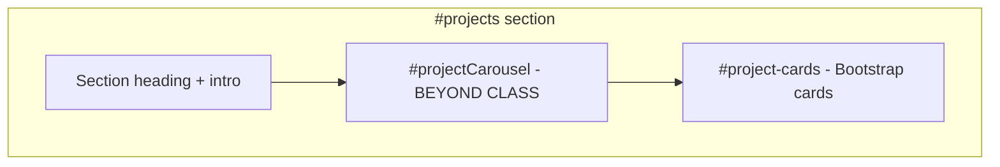
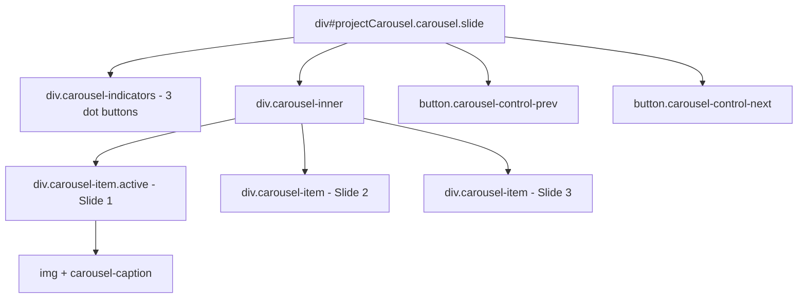
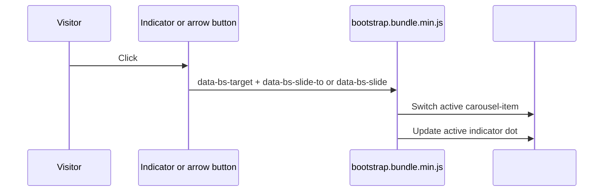
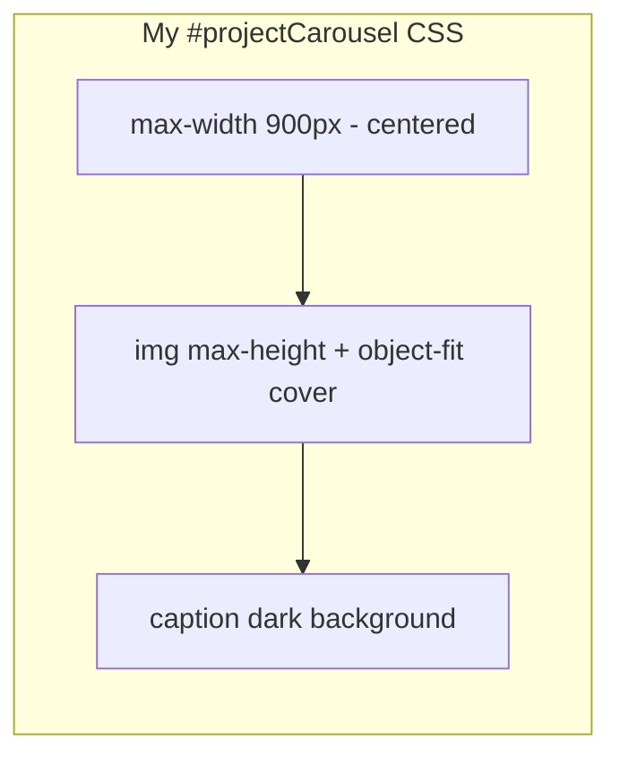
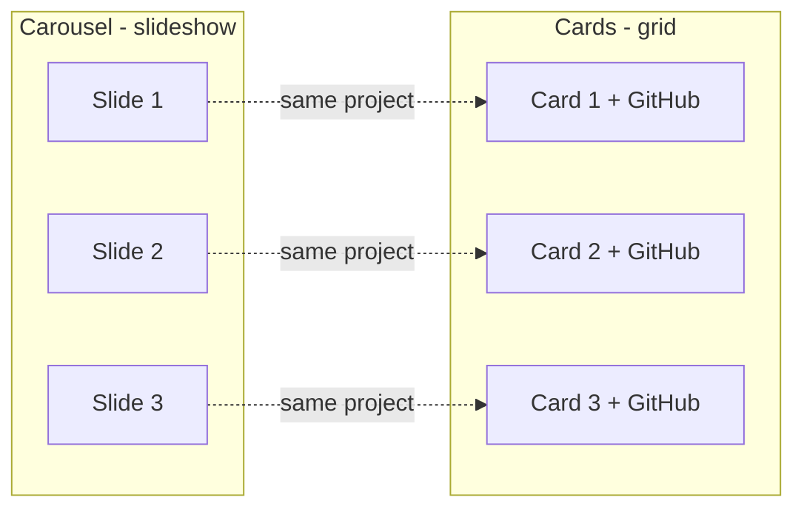

# Bootstrap Carousel Deep Dive (`#projectCarousel`)

**Author:** Emmanuel Arthur  
**Course:** CS 463/563 Final Project  
**Purpose:** In-depth explanation of my beyond-class Bootstrap carousel for the video presentation.

The lab notebook covered navbar, grid, cards, and forms. It did **not** cover the carousel. I learned this component from the [Bootstrap 5.3 Carousel documentation](https://getbootstrap.com/docs/5.3/components/carousel/) and added it to the Projects section.

---

## Where it lives on the page



| Location           | File             | Lines (approx.)                                       |
| ------------------ | ---------------- | ----------------------------------------------------- |
| HTML structure     | `index.html`     | `#projectCarousel` block inside `#projects`           |
| Custom styling     | `css/styles.css` | `#projectCarousel` rules                              |
| Slide behavior     | Bootstrap JS CDN | `bootstrap.bundle.min.js` at bottom of `index.html`   |
| Custom slide logic | -                | **None** - I did not write carousel code in `main.js` |

The carousel shows the same three outside-course projects that appear as cards below it: Retail Impact Simulator, StainCheck, and Web Security Exploitation Suite.

---

## What a carousel is (plain terms)

A carousel is a **slideshow inside one box**. Only one slide is visible at a time. Visitors can:

- click the **left/right arrows** to move one slide at a time
- click the **dots** at the bottom to jump straight to a slide

Bootstrap provides the HTML pattern, CSS classes, and JavaScript plugin. I supply the images, text, and a small amount of custom CSS so captions stay readable.

---

## HTML structure - layers from outside to inside



### Outer wrapper - `div#projectCarousel`

| Attribute / class                          | What it does                                                                    |
| ------------------------------------------ | ------------------------------------------------------------------------------- |
| `id="projectCarousel"`                     | Unique name. All buttons use `data-bs-target="#projectCarousel"` to point here. |
| `class="carousel slide"`                   | Bootstrap: this element is a carousel with slide animation.                     |
| `class="mb-4"`                             | Bootstrap spacing - margin below the carousel.                                  |
| `data-bs-ride="carousel"`                  | Tells Bootstrap to start the carousel when `bootstrap.bundle.min.js` loads.     |
| `aria-label="Project highlights carousel"` | Screen readers get a name for the slideshow region.                             |

### Indicator dots - `div.carousel-indicators`

Three `<button>` elements, one per slide. Slides are numbered from **0**:

| Dot button | `data-bs-slide-to` | Meaning                         |
| ---------- | ------------------ | ------------------------------- |
| First dot  | `0`                | Jump to slide 1 (Retail Impact) |
| Second dot | `1`                | Jump to slide 2 (StainCheck)    |
| Third dot  | `2`                | Jump to slide 3 (Web Security)  |

The first dot has `class="active"` and `aria-current="true"` because slide 1 is shown when the page loads.

### Slide container - `div.carousel-inner`

Holds all slides. Bootstrap hides every slide except the one marked `active`.

### Each slide - `div.carousel-item`

| Slide | Classes                | Image file                 | Caption title                   |
| ----- | ---------------------- | -------------------------- | ------------------------------- |
| 1     | `carousel-item active` | `images/retail-impact.jpg` | Retail Impact Simulator         |
| 2     | `carousel-item`        | `images/staincheck.jpg`    | StainCheck Mobile App           |
| 3     | `carousel-item`        | `images/web-security.jpg`  | Web Security Exploitation Suite |

Inside each slide:

- `` - full-width image
- `alt="..."` - describes the project for screen readers and when images fail to load
- `div.carousel-caption.d-none.d-md-block` - title + description overlay; **hidden on phones**, visible on medium screens and up

### Arrow buttons

| Button | Class                   | `data-bs-slide` |
| ------ | ----------------------- | --------------- |
| Left   | `carousel-control-prev` | `prev`          |
| Right  | `carousel-control-next` | `next`          |

Each arrow includes:

- A decorative icon span with `aria-hidden="true"` (ignored by screen readers)
- A `span.visually-hidden` with text "Previous" or "Next" (read by screen readers)

---

## How Bootstrap JavaScript makes it work

I did **not** write custom JavaScript for slide changes. Bootstrap reads special `data-bs-*` attributes on the HTML and wires up the behavior.



| HTML attribute                      | Role                                        |
| ----------------------------------- | ------------------------------------------- |
| `data-bs-target="#projectCarousel"` | Which carousel this control belongs to      |
| `data-bs-slide-to="0"`              | Jump to slide index (dots)                  |
| `data-bs-slide="prev"` / `"next"`   | Move one slide backward or forward (arrows) |
| `data-bs-ride="carousel"`           | Initialize carousel on page load            |

**Script tag** (bottom of `index.html`, before `main.js`):

```html
<script src="https://cdn.jsdelivr.net/npm/bootstrap@5.3.3/dist/js/bootstrap.bundle.min.js"></script>
```

Without this file, the carousel would look like static images - arrows and dots would do nothing. The accordion and mobile navbar also depend on this same script.

---

## My custom CSS (`css/styles.css`)

Bootstrap styles the basic carousel. I added three rules so it fits my site design:



| Rule                                                           | What I changed                                      | Why                                                |
| -------------------------------------------------------------- | --------------------------------------------------- | -------------------------------------------------- |
| `#projectCarousel { max-width: 900px; margin: auto; }`         | Carousel does not stretch across very wide monitors | Keeps slideshow readable and centered              |
| `.carousel-item img { max-height: 400px; object-fit: cover; }` | All slides same height; crops instead of stretching | Consistent look when switching slides              |
| `.carousel-caption { background: rgba(0,0,0,0.55); ... }`      | Dark semi-transparent box behind text               | White caption text stays readable on bright photos |

On small screens, Bootstrap class `d-none d-md-block` hides captions so phones show images only - less clutter on a narrow screen.

---

## Carousel vs. project cards below

I show each project **twice** on purpose:



| Feature      | Carousel                  | Cards below                     |
| ------------ | ------------------------- | ------------------------------- |
| Purpose      | Visual highlight, rotates | Scannable detail + GitHub links |
| Interaction  | Arrows and dots           | Click GitHub button             |
| Beyond class | Yes - carousel            | From class - Bootstrap cards    |

---

## How I tested the carousel

1. Opened https://emmarthur.github.io/ (or local `index.html` with internet for CDN).
2. Scrolled to **Projects**.
3. Clicked **next arrow** - slide 2 appeared.
4. Clicked **dot 3** - Web Security slide appeared.
5. Narrowed the browser - captions disappeared; arrows still worked.
6. Confirmed images load from `images/` folder and alt text is present.

---

## What to say in the video (short script)

> “For my beyond-class requirement I added a Bootstrap carousel in the Projects section. The lab notebook did not cover carousels - I used the Bootstrap docs to learn the markup.
>
> The HTML has an outer `div` with id `projectCarousel`, three indicator dots, a `carousel-inner` with three `carousel-item` slides, and prev/next buttons. Each slide has an image and a caption.
>
> I did not write JavaScript for the slides. Bootstrap’s bundle script reads `data-bs-target` and `data-bs-slide-to` on the buttons and handles the switching.
>
> In `styles.css` I centered the carousel, fixed image height with `object-fit: cover`, and added a dark background on captions so text stays readable.
>
> The same three projects also appear as cards below with GitHub links.”

Full video timing and demo steps: `VIDEO-PRESENTATION-OUTLINE.md` Section 3.

---

## Outside source

- [Bootstrap 5.3 - Carousel component](https://getbootstrap.com/docs/5.3/components/carousel/)
