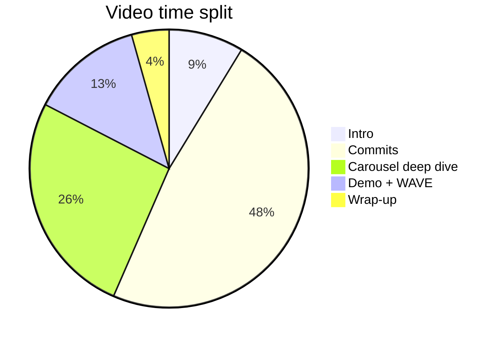

# Video Presentation Outline

**Course:** CS 463/563 - Final Project  
**Site:** emmarthur.github.io personal portfolio  
**Length:** 10-12 minutes (**hard max: 12 minutes**)

I use this outline while recording. The assignment requires me to **describe my code contributions** and **walk through my commits**. I show code in the editor or on GitHub and demo the live site where it helps.

**Deep-dive reference:** `CAROUSEL-DEEP-DIVE.md` (beyond-class carousel - main focus for Section 3)

---

## Before recording - checklist

- [ ] Repo is public: `https://github.com/emmarthur/emmarthur.github.io`
- [ ] Site is deployed: `https://emmarthur.github.io/`
- [ ] Git log open (`git log --oneline --reverse`)
- [ ] Tabs open: `index.html` at `#projectCarousel`, `css/styles.css`, `CAROUSEL-DEEP-DIVE.md`
- [ ] Browser on deployed site (desktop + narrow window for mobile)
- [ ] WAVE extension ready

**Opening line (say both URLs clearly):**

> “This is Emmanuel Arthur’s CS 463 final project - a one-page portfolio site. The GitHub repo is https://github.com/emmarthur/emmarthur.github.io and the live site is https://emmarthur.github.io/.”

---

## Time budget

| Section                     | Minutes    | Purpose                               |
| --------------------------- | ---------- | ------------------------------------- |
| 1. Intro + project overview | ~1:00      | Context and requirements met          |
| 2. Commit walkthrough       | ~5:30      | Main requirement - code contributions |
| 3. Carousel deep dive       | ~3:00      | Beyond-class feature in detail        |
| 4. Live demo + WAVE         | ~1:30      | Show it working + accessibility audit |
| 5. Wrap-up                  | ~0:30      | Sources and closing                   |
| **Total**                   | **~12:00** | Stay at or under 12 minutes           |

---

## Section 1 - Intro (~1 minute)

### What to say

> “I built a single-page professional portfolio with five areas: Home, About, Previous Work, Projects, and Contact. Everything lives in one `index.html` file plus `css/styles.css`, `js/main.js`, and `js/jquery-interactions.js`.
>
> The tech stack is HTML5, CSS, Bootstrap 5.3 from a CDN, vanilla JavaScript, and jQuery - no React or other frameworks.
>
> I made more than six meaningful git commits with descriptive messages, deployed the site on GitHub Pages, and added Bootstrap components beyond what the lab notebook covered - especially the carousel in Projects, which I’ll explain in detail later.”

### What to show

- Deployed homepage (full viewport)
- Quick scroll through all five sections

---

## Section 2 - Commit walkthrough (~5.5 minutes)

Go through commits **in order**. For each: **what changed to why to one snippet or demo**.

### Commit 1 - Initial starter files

**Say:**

> “I started with folder structure: `css/`, `js/`, `images/`, and empty placeholder files. Starting with structure before content made later steps easier.”

**Show:** GitHub file tree or `git show` for first commit.

---

### Commit 2 - Stylesheets and navbar

**Say:**

> “I added the HTML5 skeleton - doctype, charset, viewport meta, and a meta description for search engines. I linked Bootstrap CSS from jsDelivr and my `styles.css` file.
>
> I built the navbar inside a sticky `<header>` with links to `#home`, `#about`, `#previous-work`, `#projects`, and `#contact`. The navbar toggler is there for mobile; it needs Bootstrap JavaScript later to open.”

**Show:** `<head>` links and navbar in `index.html`.

---

### Commit 3 - About and Previous Work

**Say:**

> “I wrapped all content in `<main id="main-content">` and added a Home hero section. About has my photo and bio in a Bootstrap grid.
>
> Previous Work uses a Bootstrap **accordion** - that’s beyond class too, but my main deep dive is the carousel. The accordion has three panels for my BlackRock roles and education.”

**Show:** About section; one accordion header in code.

---

### Commits 4 & 5 - Projects section and carousel

**Say:**

> “I added the Projects section with three outside-course projects - not homework. I built the carousel shell first, then added three slides and the project cards below.
>
> I’ll walk through every part of the carousel in Section 3 - for now I’ll note it lives at `#projectCarousel` in `index.html`.”

**Show:** Projects heading; jump to carousel block (do not read every line yet).

---

### Commit 6 - Contact form validation

**Say:**

> “The Contact section has a labeled form with `novalidate` so my JavaScript controls errors instead of the browser defaults. In `main.js` I validate name length, email format, and message length. On success I show a teal alert in `#form-feedback`.
>
> I also update which nav link looks active when the URL hash changes, and the hero button scrolls to About without duplicating the About link - that helped with WAVE.”

**Show:** `validateContactForm` and `handleContactSubmit` in `main.js`. Submit empty form live.

---

### Later commits (30 seconds total)

**Say:**

> “Later commits added custom CSS, the footer, jQuery section highlight, README, project images, build documentation, and WAVE accessibility fixes for navbar contrast and redundant links.”

**Show:** `git log --oneline` only.

---

## Section 3 - Carousel deep dive (~3 minutes)

**Use `CAROUSEL-DEEP-DIVE.md` as the script.** Cover HTML to CSS to Bootstrap JS.

### Opening (15 seconds)

**Say:**

> “The assignment asks for Bootstrap elements we didn’t learn in the lab notebook. I used an accordion and a **carousel**. I’m going to explain the carousel line by line - it’s in the Projects section at `#projectCarousel`.”

### Part A - HTML structure (1 minute)

**Say:**

> “The outer `div` has id `projectCarousel` and classes `carousel slide`. The attribute `data-bs-ride='carousel'` tells Bootstrap to initialize it when the JS file loads.
>
> Inside I have three indicator dots - they use `data-bs-slide-to` with values 0, 1, and 2 because Bootstrap counts from zero. The first dot is `active` because slide one shows on load.
>
> The `carousel-inner` holds three `carousel-item` divs. Only the first has `active`. Each slide has an image from my `images/` folder and a `carousel-caption` with the project title and description.
>
> Left and right arrows use `data-bs-slide='prev'` and `'next'`. Screen readers get ‘Previous’ and ‘Next’ from `visually-hidden` spans.”

**Show:** Scroll through carousel HTML in `index.html`. Click arrows and dots on live site while naming each part.

### Part B - Custom CSS (45 seconds)

**Say:**

> “Bootstrap handles the basic slideshow look. I added three rules in `styles.css`: max-width 900 pixels and centered margins, `max-height` and `object-fit: cover` on images so slides stay the same height, and a semi-transparent dark background on captions so white text stays readable on photos.
>
> The class `d-none d-md-block` on captions hides text on phones - only the image shows on small screens.”

**Show:** `#projectCarousel` rules in `css/styles.css`. Resize browser to show captions hiding.

### Part C - JavaScript (45 seconds)

**Say:**

> “There is no carousel code in `main.js`. Bootstrap’s `bootstrap.bundle.min.js` at the bottom of `index.html` reads the `data-bs-target` and `data-bs-slide` attributes and wires up the slideshow. Same script powers the accordion and the mobile navbar.”

**Show:** Bootstrap `<script>` tag at bottom of `index.html`.

### Part D - Why cards below (15 seconds)

**Say:**

> “The carousel highlights projects visually. The Bootstrap cards below show the same three projects with GitHub links - carousel for the beyond-class component, cards for scannable detail.”

**Show:** Cards grid under carousel.

### Accordion - one sentence only

**Say:**

> “The Previous Work accordion uses the same Bootstrap JS pattern with `data-bs-toggle='collapse'` - same idea, different component.”

---

## Section 4 - Live demo + WAVE (~1.5 minutes)

### Quick demo table

| Action                               | What it proves                   |
| ------------------------------------ | -------------------------------- |
| Projects to carousel arrows and dots | Bootstrap JS + my HTML           |
| Narrow browser                       | Captions hide; slides still work |
| Previous Work accordion              | Bootstrap collapse               |
| Contact to submit empty              | `main.js` validation             |
| Contact to valid submit              | Success alert styling            |
| Tab through navbar                   | Orange focus outlines in CSS     |

### WAVE audit - what to say

**Run WAVE on https://emmarthur.github.io/.**

**Say:**

> “I ran WAVE on the deployed site as required. My first audit had six navbar contrast errors and two redundant Home links. I fixed those - full white links on teal, removed the duplicate Home nav item, changed the hero CTA to a button, and gave each project a distinct GitHub URL.
>
> After fixes I had zero alerts and zero errors, but **two contrast errors remain** on the hero heading and intro paragraph. WAVE is strict about text on CSS gradients. I added a `.hero-panel` with solid background `#003838` behind the text, which passes a manual contrast check, but WAVE still flags those two elements.
>
> I went from eight findings down to two and documented what’s left honestly in my journal.”

**Optional show:** `.hero-panel` in `css/styles.css`; WebAIM contrast checker with white on `#003838`.

---

## Section 5 - Wrap-up (~30 seconds)

**Say:**

> “Main outside sources: Bootstrap 5.3 documentation for the carousel and accordion, jsDelivr CDN, Unsplash for project images, and WAVE for accessibility testing.
>
> The site is deployed at emmarthur.github.io with at least six commits, custom CSS and JavaScript, and the carousel as my beyond-class deep dive. My journal PDF and links are submitted on Canvas. Thanks for watching.”

---

## Grading checklist (mention if time)

| Requirement          | Where on my site                                 |
| -------------------- | ------------------------------------------------ |
| Navbar               | `<header>` + `.navbar`                           |
| About + photo        | `#about`                                         |
| Previous Work        | `#previous-work` + accordion                     |
| 2-3 outside projects | `#projects` cards + carousel                     |
| Contact form         | `#contact` + `#main.js` validation               |
| CSS file             | `css/styles.css`                                 |
| JS interactivity     | `js/main.js`                                     |
| Beyond class (video) | `#projectCarousel` - see `CAROUSEL-DEEP-DIVE.md` |
| 6+ commits           | Git log                                          |
| Deploy + README      | GitHub Pages + `README.md`                       |

---

## What NOT to spend time on

- Reading every line of the accordion aloud
- Long biography text
- Apologizing for the two remaining WAVE contrast errors - explain them clearly instead
- jQuery (one line: orange flash on nav click in `jquery-interactions.js`)

---

## Recording setup

1. Split screen: IDE on carousel code + browser on Projects section
2. Quiet room; speak slowly - 12 minutes max
3. Practice once with a timer; shorten Commit 1 and later doc commits if running long

---

## What breaks if code is removed (talking points)

These notes support the commit walkthrough and carousel deep dive. They describe how the live page degrades when major pieces are deleted, without re-reading every file on camera.

| Removed piece | What to say in the video |
| ------------- | ------------------------ |
| Bootstrap CSS CDN | Navbar, grid, cards, and forms lose Bootstrap layout; the page looks like unstyled HTML. |
| `css/styles.css` | Teal theme, hero panel, carousel caption backgrounds, navbar contrast fixes, and orange focus outlines disappear. |
| `bootstrap.bundle.min.js` | Carousel arrows and dots, accordion panels, and the mobile hamburger stop responding to clicks. |
| `#projectCarousel` HTML | The beyond-class slideshow is gone; only static project cards might remain. |
| `main.js` | Contact form validation and success alert stop; navbar active highlighting and hero scroll button stop. |
| `jquery-interactions.js` | Orange section flash on nav clicks stops; everything else still works. |
| WAVE fixes (navbar white links, no duplicate Home link, hero button) | Contrast errors or redundant-link alerts return in WAVE; see `WAVE-AUDIT-FIXES.md`. |
| `.hero-panel` CSS | Hero heading and intro may fail contrast checks against the gradient background. |
| `images/` files | Broken images in About and carousel slides. |

Full step-by-step impact: `BUILD-STEPS.md` (**If removed** under each step). Carousel-specific table: `CAROUSEL-DEEP-DIVE.md`.
